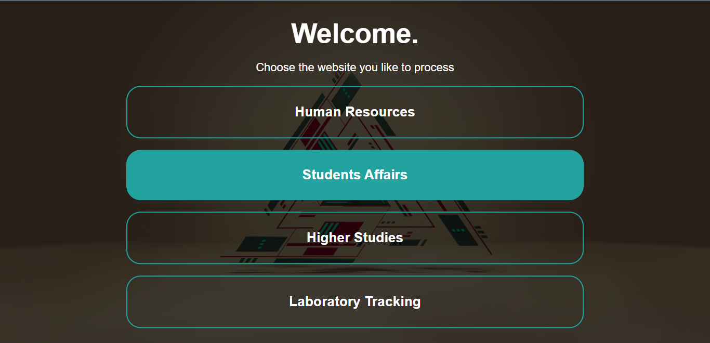
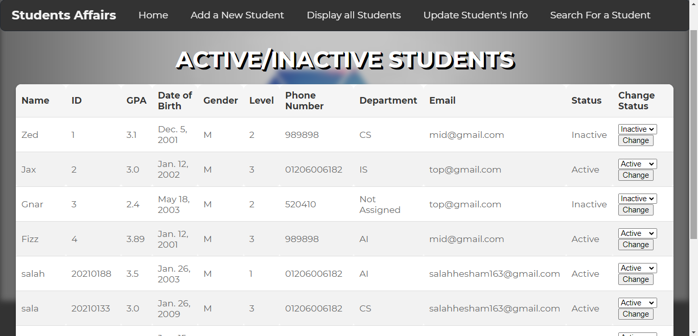
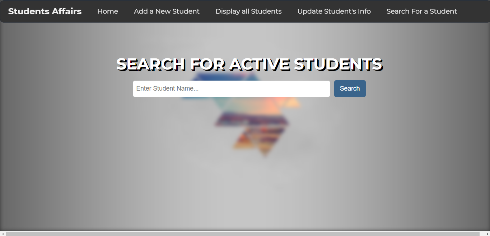

# Student Affairs Management System

## Overview

The **Student Affairs Management System** is a web application built using **Django**, designed to streamline the management of student information within an educational institution. This system allows administrators to perform various tasks, including adding new students, updating their information, assigning or modifying department information, and searching for students efficiently.

## Features

1. **Add New Students**: Easily add new student records to the system. Input essential details such as name, contact information, date of birth, and more. The system automatically generates a unique student ID.

2. **Update Student Information**: Administrators can edit and update student information as needed. This includes modifying contact details, updating academic records, and keeping student profiles up to date.

3. **Assign or Modify Departments**: Assign students to specific departments or modify their department assignment when necessary. Ensure accurate departmental records for each student.

4. **Search for Students**: The system offers a robust search functionality, allowing users to quickly locate specific students by name, student ID, or other criteria. This makes it easy to access individual student profiles and their relevant information.

## Team Members

- [Basma Mahmoud](https://github.com/Basma2423) - Team Leader
- [Ahmed Nabil](https://github.com/Ahmednabi1)
- [Ahmed Ezzat](https://github.com/ANTITRIX)
- [Laila Hesham]
- [Hagar Galal]
- [Salah Hesham](https://github.com/salahhesham8)

## Home Page

## Displaying Students

## Searching For Students


## Technologies and Frameworks Used

- **Django**: Our robust backend framework that powers the core of the Student Affairs Management System.
- **JavaScript**: Used to enhance the interactivity and functionality of the web application.
- **CSS**: Responsible for styling and making the user interface visually appealing.
- **HTML**: The fundamental building block of our web pages, defining their structure and content.

## Installation

To get this project up and running on your local machine, follow these steps:

1. **Clone the repository**:
   ```
   git clone <repository-url>
   cd student-affairs-management-system
   ```
2. **Create a virtual environment (recommended)**:
   ```
   python -m venv venv
   ```
3. **Activate the virtual environment**:
    Linux/macOS:
    ```
    source venv/bin/activate
    ```
    Windows:
    ```
    venv\Scripts\activate
    ```
3. **Install project dependencies**:
    ```
    pip install -r requirement.txt
    ```
4. **Run database migrations**:
    ```
    python manage.py migrate
    ```
5. **Start the development server**:
    ```
    python manage.py runserver
    ```
6. Access the application in your web browser at http://localhost:8000.


